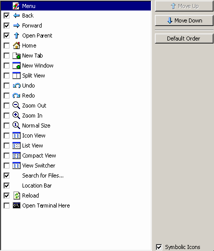
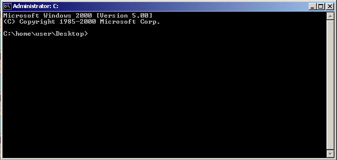
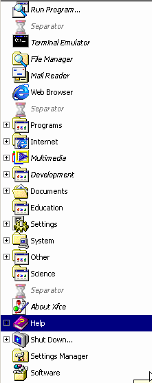

<a name="index"/>

# Index

<!--ts-->
* [Installing MENT2K](#install_theme)
* [Optional Steps](#optional)
<!--te-->

<a name="install_theme"/>

## Installing MENT2K
> Note: the theme assumes you have installed the XFCE Desktop Environment in advance.

### Manual installation and configuration steps

Open a terminal.

Create required directories:
Run:

    mkdir -p "$HOME/.themes" "$HOME/.icons" "$HOME/.local/share/xfce4-panel-profiles" "$HOME/.config/menus/menu-backup" "$HOME/.local/share/desktop-directories" "$HOME/.config/autostart" ~/.icons/default

Also create system-wide theme/icon directories (requires sudo):

    sudo mkdir -p /usr/share/themes /usr/share/icons /usr/local/share/fonts/tahoma

### Copy theme and icon files:
Copy to your home:

    cp -r Theme/MENT2K "$HOME/.themes/"
    cp -r Icons/Idk2k "$HOME/.icons/"

Copy system-wide (sudo):

    sudo cp -r Theme/MENT2K /usr/share/themes/
    sudo cp -r Icons/Idk2k /usr/share/icons/

Update lightdm greeter CSS file (sudo):

    sudo cp -v Lightdm/lightdm-gtk-greeter.css /usr/share/themes/MENT2K/gtk-3.0/apps/lightdm-gtk-greeter.css

Install required packages (Debian/Ubuntu):

    sudo apt update
    sudo apt install -y lxappearance marco mate-control-center mate-tweak gtk2-engines-pixbuf xfce4-panel-profiles picom wget unzip

Install panel profile and back up current panel config:
Create profile dir (if not already):

    mkdir -p ~/.local/share/xfce4-panel-profiles

Copy xfce-panel profile archive:

    cp -r Misc/Panel-profiles/MENT2K.tar.bz2 ~/.local/share/xfce4-panel-profiles/

Back up current panel XML:

    mkdir -p "$HOME/.config/menus/menu-backup"
    cp -r "$HOME/.config/xfce4/xfconf/xfce-perchannel-xml/xfce4-panel.xml" "$HOME/.config/menus/menu-backup/xfce4-panel.xml.bak"

Install desktop-directory files:

    cp -v Misc/xfce-games.directory ~/.local/share/desktop-directories/xfce-games.directory
    cp -v Misc/xfce-office.directory ~/.local/share/desktop-directories/xfce-office.directory
    cp -v Misc/xfce-settings.directory ~/.local/share/desktop-directories/xfce-settings.directory
    cp -v Misc/xfce-accessories.directory ~/.local/share/desktop-directories/xfce-accessories.directory

Load the XFCE panel profile:

    xfce4-panel-profiles load ~/.local/share/xfce4-panel-profiles/MENT2K.tar.bz2

> **If that didn't work:** right click the xfce4-panel, go to Panel preferences and click "Backup and restore". Click on "MENT2K" and "apply configuration".

Set GTK and icon themes for GNOME/MATE/Xfce:

    gsettings set org.gnome.desktop.interface gtk-theme 'MENT2K'
    gsettings set org.gnome.desktop.interface icon-theme 'Idk2k'
    gsettings set org.mate.interface gtk-theme 'MENT2K'
    gsettings set org.mate.interface icon-theme 'Idk2k'
    xfconf-query --channel xsettings --property /Gtk/ThemeName --set 'MENT2K'
    xfconf-query --channel xsettings --property /Net/ThemeName --set 'MENT2K'
    xfconf-query --channel xsettings --property /Net/IconThemeName --set 'Idk2k'
    xfconf-query --channel xsettings --property /Gtk/IconThemeName --set 'Idk2k'

Change cursor theme:
Copy index.theme:

    cp Misc/index.theme ~/.icons/default/

Install cursor set system-wide and symlink for user:

    sudo cp -r "Cursors/Chicago95 Standard Cursors" /usr/share/icons
    ln -s /usr/share/icons/"Chicago95 Standard Cursors"/cursors ~/.icons/default/cursors

Backup and replace menu files:

    mkdir -p "$HOME/.config/menus/menu-backup"
    mv "$HOME/.config/menus/applications-merged" "$HOME/.config/menus/menu-backup/" 2>/dev/null || true
    mv "$HOME/.config/menus/xfce-applications.menu" "$HOME/.config/menus/menu-backup/" 2>/dev/null || true
    sudo cp -r Misc/menus/* "$HOME/.config/menus/"

Copy desktop shortcuts to Desktop:

    cp -r Misc/desktop-shortcuts/ "$HOME/Desktop"

Make marco the default session/window manager:

    sudo update-alternatives --set x-session-manager /usr/bin/marco

Install and apply Redmond97 window theme:
Clone repository:

    git clone github.com/matthewmx86/Redmond97.git

Copy theme to your user themes directory (note: sudo may be required to write to /usr/share/themes; this copies to ~/.themes):

    cp -r "Redmond97/Theme/no-csd/Redmond97 Millennium" ~/.themes/

Remove the cloned repo:

    rm -rf Redmond97

Configure picom and startup script:
Copy picom config:

    cp -r Misc/picom.conf ~/.config/

Copy startup script to /etc and make executable:

    sudo cp -r Misc/.startup/.startup-marco.sh /etc/
    sudo chmod +x /etc/.startup-marco.sh

Create autostart desktop entry:

    cat > ~/.config/autostart/startup-marco.desktop <<'EOF'
    [Desktop Entry]
    Type=Application
    Name=startup-marco
    Exec=/etc/.startup-marco.sh
    X-GNOME-Autostart-enabled=true
    NoDisplay=false
    EOF
    sudo chmod +x "~/.config/autostart/startup-marco.desktop" || true

Apply Marco theme and fonts:

    gsettings set org.mate.Marco.general theme 'Redmond97 Millennium'
    sleep 0.2
    gsettings set org.mate.interface font-name 'Tahoma 8'
    gsettings set org.gnome.desktop.wm.preferences titlebar-font 'Tahoma Bold 8'
    gsettings set org.mate.Marco.general titlebar-font 'Tahoma Bold 8'

Change XFCE desktop background to a solid color and install Background.png:

    cp -r Misc/Background.png ~/.themes/
    xfconf-query --channel xfce4-desktop --list | grep last-image | xargs -r xfconf-query -c xfce4-desktop -s ~/.themes/Background.png -p

#### Desktop options:

Right click on your desktop background (xfdesktop) and click "Desktop settings"

Set style to "None".

Click on the color box and click on "+" under "Custom".

Paste in this color tag: #3D6FA2 and click "select".

Go into the "Desktop Icons" tab and change the icon size to 32.

Set the "Show icon tooltips: Size:" to 4.

You can optionally set the label background colour to "#3D6FA2".

----------

#### Thunar configuration:

    echo '(gtk_accel_path "<Actions>/ThunarWindow/view-location-selector-entry" "true")' >> ~/.config/Thunar/accels

Configure the Thunar toolbar to match this screenshot:

----------

Download and optionally install Tahoma fonts:

    wget "www.dafontfree.co/wp-content/uploads/download-manager-files/Tahoma-4styles-Font.zip"
    unzip -o "Tahoma-4styles-Font.zip" -d ./Tahoma-4styles-Font

Install font files system-wide:

    sudo cp ./Tahoma-4styles-Font/TAHOMA_0.TTF /usr/share/fonts/truetype/
    sudo cp ./Tahoma-4styles-Font/TAHOMAB0.TTF /usr/share/fonts/truetype/
    sudo cp ./Tahoma-4styles-Font/TAHOMABD.TTF /usr/share/fonts/truetype/
    sudo cp ./Tahoma-4styles-Font/"Tahoma Regular font.ttf" /usr/share/fonts/truetype/
    sudo fc-cache -fv

Set Xfce font settings:

    xfconf-query --channel xsettings --property /Gtk/FontName --set "Tahoma 8"
    xfconf-query -c xsettings -p /Xft/Antialias -s 0
    xfconf-query -c xsettings -p /Xft/Hinting -s 1
    xfconf-query -c xsettings -p /Xft/HintStyle -s hintfull
    xfconf-query -c xsettings -p /Xft/RGBA -s vgbr

Replace LightDM greeter configuration:

    sudo mv /etc/lightdm/lightdm-gtk-greeter.conf /etc/lightdm/lightdm-gtk-greeter.conf.bak
    sudo cp -r Lightdm/lightdm-gtk-greeter.conf /etc/lightdm/

Replace Whisker menu icon and label:
Copy icon:

    sudo cp -r Misc/windowsstart2.png /etc/

Set panel button title and icon (adjust plugin number if different):

    xfconf-query -c xfce4-panel -p /plugins/plugin-5/button-title --create -t string -s "Start"
    xfconf-query -c xfce4-panel -p /plugins/plugin-5/button-icon --create -t string -s "/etc/windowsstart2.png"
    xfce4-panel -r

Configure compositor (no window shadows) and start picom:
Replace current window manager with marco no-composite:

    marco --replace --no-composite &

Restart picom:

    pkill picom || true
    picom --config ~/.config/picom.conf &

Final steps:
The script recommends rebooting. If you want to reboot now:

    sudo reboot

Otherwise log out and log back in (or reboot) to ensure all theme and session changes take effect.

----------
<a name="optional"/>

## Optional:

### Windows CMD font and CMD feel:

Download and extract:

    wget "https://www.yohng.com/files/TerminalVector.zip"
    unzip -o "TerminalVector.zip" -d ./TerminalVector
    
    sudo cp ./TerminalVector/TerminalVector.ttf /usr/share/fonts/truetype/
    sudo fc-cache -fv

Go into "Terminal Preferences" and into the "Appearance" tab.

Pick a font and pick the font "Terminal Vector Normal" and set the value of "Size" to 9.

Go to the "General" tab and set Dynamically-set title to "Isn't displayed" and "Initial title" to:

     Administrator: C:

Then set cursor shape to "Underline" and check "Cursor Blinks".

Add this line of code to the end of your .bashrc file (located in ~/):

	function msdos_pwd
	{
	    local dir="`pwd`"

	    echo $dir | tr '/' '\\'
	}

	export PS1='C:`msdos_pwd`> '

	echo "Microsoft Windows 2000 [Version 5.00]"
	echo "(C) Copyright 1985-2000 Microsoft Corp."
	echo

	export LD_PRELOAD=/usr/lib/x86_64-linux-gnu/libgtk3-nocsd.so.0

Your terminal should now look something like this: 

### Start menu:

Go to the menu-editor (often called menulibre)

Make it match this image:

*rename "Games" into "Shutdown..." and create a logut shortcut (xfce4-session-logout), rename "Office" into "Help", rename "Accesories" into "Programs".*

> ## Notes and cautions:

> Run most commands as your normal desktop user (not root) except where sudo is explicitly used. If gsettings or xfconf-query commands fail when run from a script or at login, ensure the commands run in your graphical session with DBUS_SESSION_BUS_ADDRESS set. Adjust monitor names in xfconf-query lines to match your system (use xfconf-query -c xfce4-desktop -l to inspect existing properties).

> I (The maintainer of MENT2K) won't take any responbility for broken systems. A restore point is recommended.

