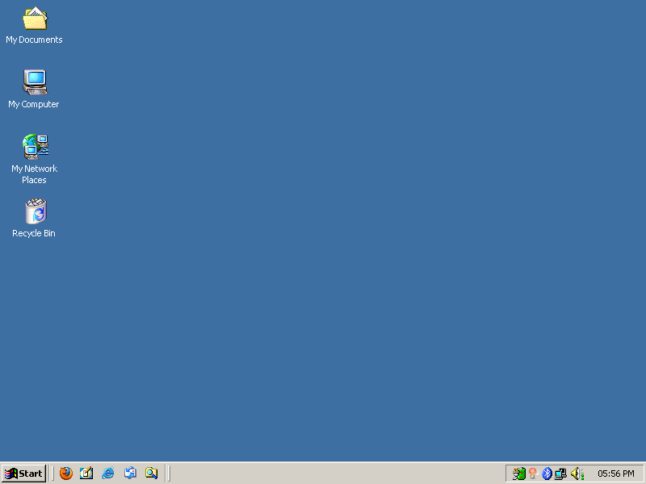

# MENT2K
#### XFCE / Xubuntu Windows 2000 look and feel.

<p align="center">

</p>

*Click [here](Screenshots/SCREENSHOTS.md) for more screenshots*

A fork of the Chicago95 theme which looks like Windows 2000 and focuses on details.

### Included in this theme:

- A look-alike start menu.
- A bordered system tray.
- Custom icon theme. (Forked from SE98)
- A cool login screen.
- etc.

### Requirements:

- GTK3+
- Xfce 4.12 - 4.21.
- gtk2-engines-pixbuf (Recommended for GTK2 applications).
- The xfce4-panel-profiles package.
- A Window compositor (Picom).
- Marco window manager for gradient titlebars.
  
-----

## Installation

Navigate to the project folder in Thunar after extracting it, and then right-click in an empty area.

Click on "Open Terminal Here" and write this into the terminal that pops up:

```sh
bash ./install.sh
```

### OR

Write this into your terminal without downloading anything at advance:
```sh
git clone https://github.com/User738git/MENT2K.git

cd ~/MENT2K

bash ./install.sh
```

*Notice: The install-script is an early WP. I (The maintainer of MENT2K) won't take any responbility for broken systems. A restore point is recommended.*

### Manual installation

If you prefer to install MENT2K manually, [Click here](INSTALL.md).

> ### Changed your mind?

An uninstall script will be added when I get time.

### Install the LibreOffice icon theme from Chicago95:
[Click here](https://github.com/grassmunk/Chicago95/blob/master/Extras/libreoffice-chicago95-iconset/README.md) for installing the LibreOffice Chicago95 icon theme.

----
## Pictures

### Desktop comparison (Picture 1 taken from Windows 2000)


### Start menu


### Login screen


### Thunar top bar


### The theme in action on a CRT-monitor.


### Tested on:

- Xubuntu, Xfce 4.20.

- Xubuntu, Xfce 4.18.1.

- Mint, 4.18.1.

- In process: Debian 13, Xfce 4.20.

### Screenshots:
[Click here to view screenshots](Screenshots/SCREENSHOTS.md)

----
### Projects by other people you should check out:
[Chicago95](https://github.com/grassmunk/chicago95)

[Redmond97](https://github.com/matthewmx86/Redmond97)

[Ice2K.sys](https://toiletflusher.neocities.org/ice2k/)

[xfce-winxp-tc](https://github.com/rozniak/xfce-winxp-tc)

[aerothemeplasma](https://gitgud.io/wackyideas/aerothemeplasma/)

[SE98](https://github.com/nestoris/Win98SE)

----
### Forked code
Chicago95: https://github.com/grassmunk/chicago95

Redmond97: https://github.com/matthewmx86/Redmond97

SE98: https://github.com/nestoris/Win98SE
### Code and license
License: GPL-3.0+/MIT

[obs-repo]: https://software.opensuse.org//download.html?project=home%3Abgstack15%3AChicago95&package=chicago95-theme-all

----
### Notice
### Microsoft® Windows™ is a trademark of Microsoft® Corporation. This name is mentioned solely for reference purposes and is not intended to infringe upon Microsoft's copyrights. © 2024 Microsoft. All rights reserved. All resources from Microsoft Corporation are the property of Microsoft Corporation.
