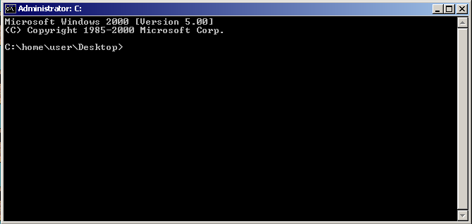
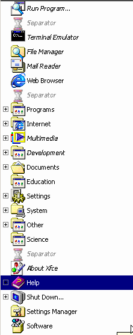

-----
# Remaining Steps:

<a name="index"/>

# Index

<!--ts-->
* [Installing MENT2K](#install_theme)
* [Optional Steps](#optional)
<!--te-->

<a name="optional"/>

## Optional:

### Windows CMD font and CMD feel:

Download and extract:

    wget "https://www.yohng.com/files/TerminalVector.zip"
    unzip -o "TerminalVector.zip" -d ./TerminalVector
    
    sudo cp ./TerminalVector/TerminalVector.ttf /usr/share/fonts/truetype/
    sudo fc-cache -fv

Go into "Terminal Preferences" and into the "Appearance" tab.

Pick a font and pick the font "Terminal Vector Normal" and set the value of "Size" to 9.

Go to the "General" tab and set Dynamically-set title to "Isn't displayed" and "Initial title" to:

     Administrator: C:

Then set cursor shape to "Underline" and check "Cursor Blinks".

Add this line of code to the end of your .bashrc file (located in ~/):

	function msdos_pwd
	{
	    local dir="`pwd`"

	    echo $dir | tr '/' '\\'
	}

	export PS1='C:`msdos_pwd`> '

	echo "Microsoft Windows 2000 [Version 5.00]"
	echo "(C) Copyright 1985-2000 Microsoft Corp."
	echo

	export LD_PRELOAD=/usr/lib/x86_64-linux-gnu/libgtk3-nocsd.so.0

Your terminal should now look something like this: 

### Start menu:

Go to the menu-editor (often called menulibre)

Make it match this image:

*rename "Games" into "Shutdown..." and create a logut shortcut (xfce4-session-logout), rename "Office" into "Help", rename "Accesories" into "Programs".*

> ## Notes and cautions:

> Run most commands as your normal desktop user (not root) except where sudo is explicitly used. If gsettings or xfconf-query commands fail when run from a script or at login, ensure the commands run in your graphical session with DBUS_SESSION_BUS_ADDRESS set. Adjust monitor names in xfconf-query lines to match your system (use xfconf-query -c xfce4-desktop -l to inspect existing properties).

> I (The maintainer of MENT2K) won't take any responbility for broken systems. A restore point is recommended. Install MENT2K at your own risk.
